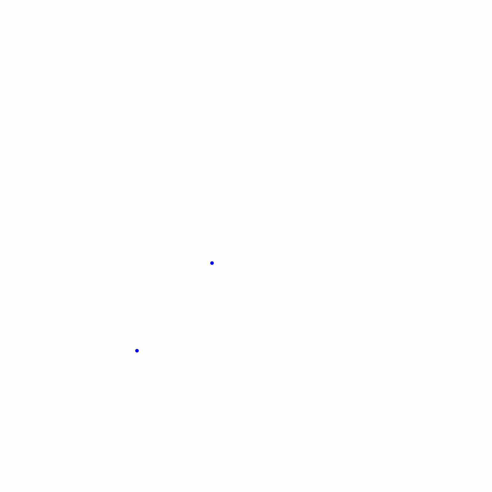
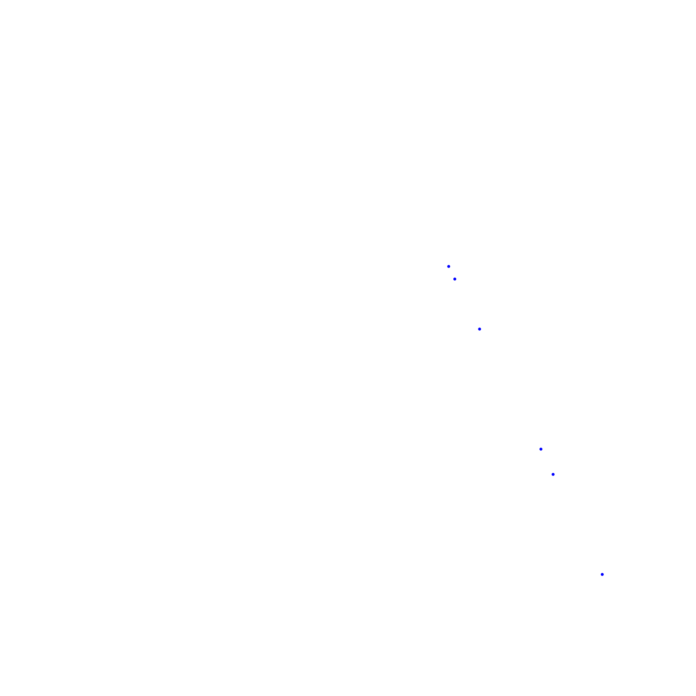
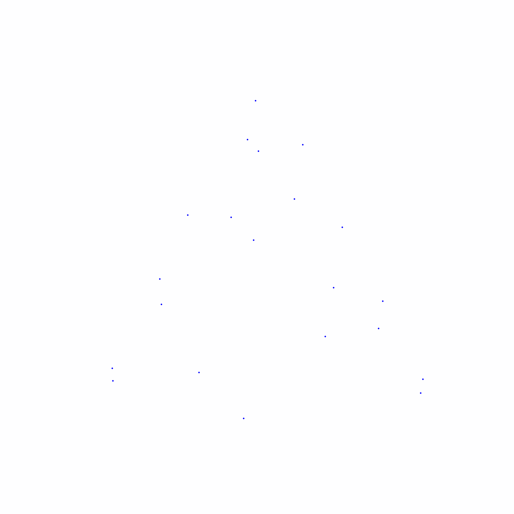

# The Chaos Game, or how to create Order out of Chaos

Creating one of the most famous fractals by using randomness.
So, you have probably heard about the Sierpinski Triangle. And if you haven't heard about it, you probably have seen it before. 

It feels so in order, full of patterns. But what if we could create such a figure out of pure randomness? 
This is called [*The Chaos Game*](https://en.wikipedia.org/wiki/Chaos_game). The procedure goes as follows: 

1. Choose a point within the starting triangle (in whichever way you prefer, even randomly) and mark it. 
2. Randomly choose one of the three corners. 
3. Walk halfway to that corner, and mark the new spot. 
4. Go back to point 2 and repeat until you get bored. 

That's it. Wait a bit and it will draw itself. No kidding. 
I created a (very) simple code to create a GIF showing how it just magically apperead. Below you can see the results with 4 different speeds. 

  
  
  
  

For me, one of these results that only makes sense once you know the answer. So, why does it happen?
Think about it this way: Is it possible for you to draw a point in the big triangle in the middle? Well, yeah, obviosly, after all, at least the first point is *randomly* chosen, what if we just pick that area here? Yeah, then you are going to have a point inside this area. But what about afterwards? It is actually **impossible** to get back in there. And guess what happens when you iterate by going repeteadly halfway to the corners. That area in the middle starts to make it impossible to reach its clones as well, growing the *impossible to draw* area right in the same way as the Sierpinski Triangle is defined. 

And just to finish this miniature repo, think about this: The only area which is possible to keep drawing should be the borders of the triangles (the lines *around* them, nothing in their *insides*). But this are actually of null area (and thus, null probability of getting any marker). So how is it possible that that's the only thing we are actually seeing? 
